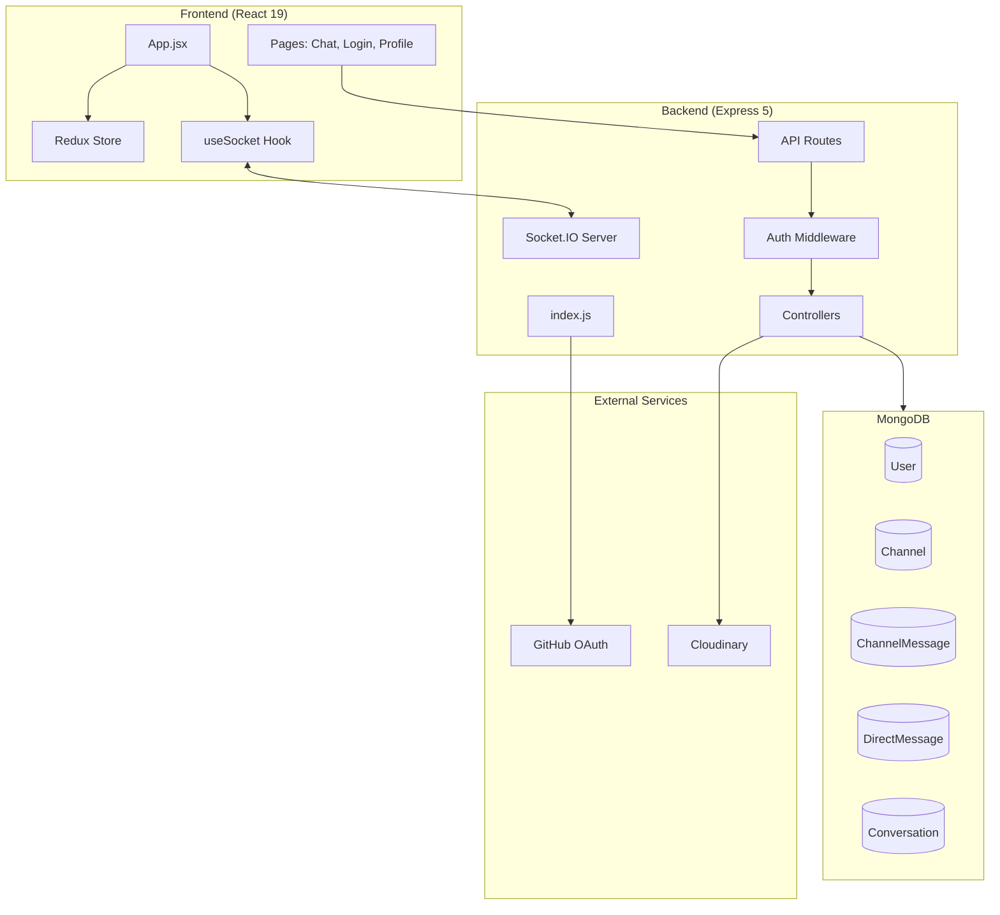
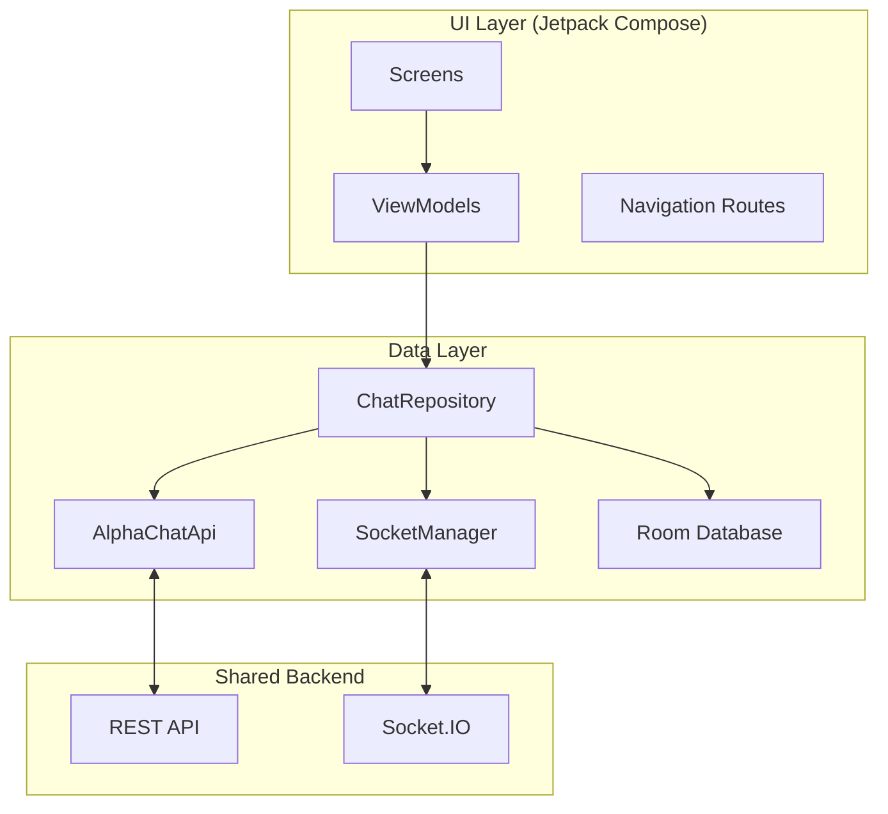

# AlphaChat Unified Architecture Analysis

## Executive Summary

AlphaChat has evolved into a **fully synchronized, multi-platform ecosystem**. Both the Web (AlphaChat-V2) and Mobile (Alpha-Chat-Native) applications now operate in perfect harmony, powered by a single shared backend infrastructure.

| Aspect | AlphaChat-V2 (Web) | Alpha-Chat-Native (Mobile) |
|--------|-------------------|---------------------------|
| **Backend** | Express 5 + MongoDB | Express 5 + MongoDB (via API) |
| **Frontend** | React 19 + Redux | Jetpack Compose |
| **Real-time** | Socket.IO | Socket.IO |
| **Auth** | GitHub OAuth | GitHub OAuth (via Web View/API) |
| **Storage** | Cloudinary | Cloudinary |
| **Sync** | Real-time | Real-time + Offline-First (Room) |

> [!IMPORTANT]
> **Unified Architecture**: The "Two Independent Systems" model has been deprecated. The mobile app has successfully migrated from Firebase to the unified Express/MongoDB backend, ensuring consistent data, authentication, and real-time communication across all platforms.

---

## 🌐 AlphaChat-V2 (Web Application)

### Architecture Diagram



### Data Models & Real-time (Source of Truth)

The Web Backend defines the source of truth for all data models (`User`, `Channel`, `Message`) and real-time events (`directMessage`, `channelMessage`, `typing`, `onlineUsers`).

---

## 📱 Alpha-Chat-Native (Mobile Application)

The mobile application has been re-architected to act as a proper client of the main backend, mirroring the web client's capabilities while adding offline reliance.

### Architecture Diagram



### Synchronization Strategy: "Harmonious Sync"

The mobile app achieves harmony with the web platform through a three-pronged synchronization strategy:

#### 1. API Integration (Restful Sync)
The mobile app uses `Retrofit` to consume the same REST endpoints as the web frontend.
- **Tools**: Retrofit, Moshi, OkHttp
- **Endpoints**: `api/auth/me`, `api/users`, `api/channels`, `api/messages/dm/...`
- **Authentication**: Usage of session cookies shared with the backend.

#### 2. Real-Time Parity (Socket.IO)
The `SocketManager` class in the mobile app listens to the **exact same events** as the React frontend, ensuring instant updates.

| Event | Mobile Action | Web Action | Result |
|-------|---------------|------------|--------|
| `directMessage` | Stores in Room, updates UI | Updates Redux, updates UI | Seamless conversation sync |
| `channelMessage` | Stores in Room, updates UI | Updates Redux, updates UI | Unified group chat experience |
| `onlineUsers` | Updates live list | Updates live list | Consistent presence data |
| `userTyping` | Shows "Typing..." | Shows "Typing..." | Real-time awareness |

#### 3. Offline-First Caching (Room)
To handle mobile network flakiness, the app implements a "Single Source of Truth" pattern using the Room database.
1. **Load**: UI observes Room database flow.
2. **Fetch**: Repository fetches fresh data from API.
3. **Cache**: Fresh data is inserted into Room.
4. **Update**: Room emits new data to UI automatically.

### Key Code Artifacts

#### [AlphaChatApi.kt](file:///d:/Workspace/Alpha-Chat-Native/app/src/main/java/com/example/alpha_chat_native/data/remote/AlphaChatApi.kt)
Defines the contract with the unified backend.
```kotlin
interface AlphaChatApi {
    @GET("api/auth/me")
    suspend fun getCurrentUser(): CurrentUserResponse

    @POST("api/messages/dm/{recipientId}")
    suspend fun sendDirectMessage(...): ApiResponse<MessageResponse>
    
    @GET("api/channels")
    suspend fun getAllChannels(): ApiResponse<ChannelsListResponse>
}
```

#### [SocketManager.kt](file:///d:/Workspace/Alpha-Chat-Native/app/src/main/java/com/example/alpha_chat_native/data/remote/SocketManager.kt)
Handles the heartbeat of the application.
```kotlin
socket.on("directMessage") { args ->
    val message = parseDirectMessage(args)
    _directMessages.tryEmit(message)
}
```

---

## 🔄 How We Achieved Synchronization

The harmonization was achieved through the following key changes:

1.  **Backend Migration**: We abandoned the Firebase-only architecture for the mobile app and pointed it to the `onrender.com` Express backend.
2.  **Model Alignment**: The mobile `Message` and `User` data classes were refactored to match the MongoDB schemas (e.g., using `_id` instead of `uid`, `username` instead of just `email`).
3.  **Auth Consolidation**: Adopted a session-based auth flow compatible with the backend's GitHub OAuth, allowing users to log in on mobile and access the same profile as on web.
4.  **Socket.IO Adoption**: Replaced Firestore listeners with a custom `SocketManager` to handle the specific event protocol defined by the web backend.

## ✅ Current Status

Both applications now "speak the same language." A message sent from the web app:
1.  Goes to the **Express Backend**.
2.  Is saved in **MongoDB**.
3.  Is broadcast via **Socket.IO**.
4.  Is received by the **Mobile App** via `SocketManager`.
5.  Is displayed instantly to the user on their phone.

This completes the transition to a unified architecture.
